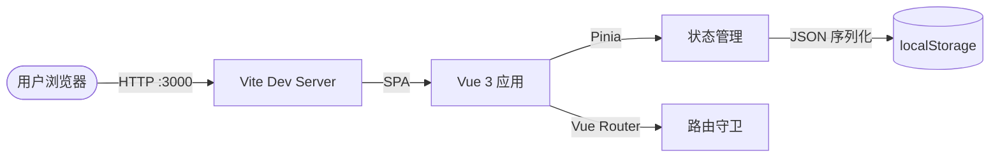
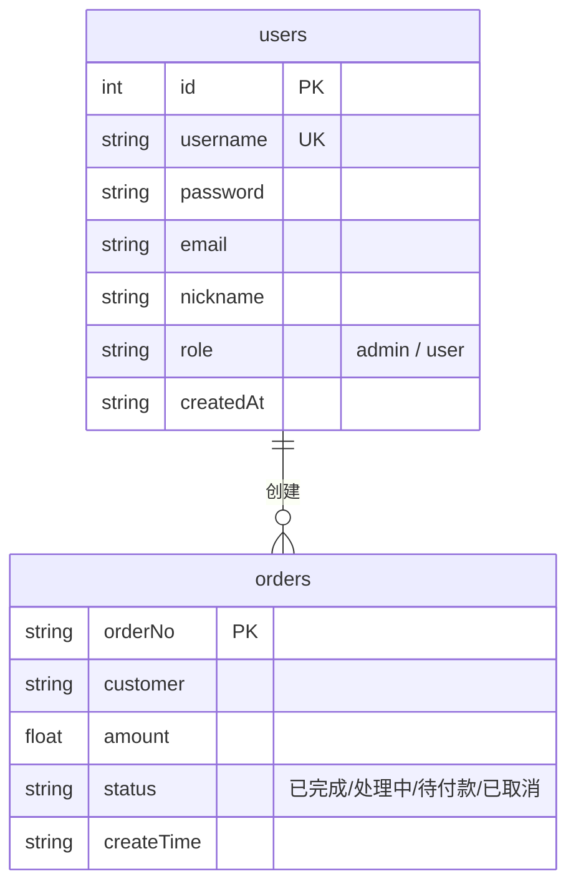

# 📦 OMS — 后台订单管理系统

> **基于 Vue 3 + Element Plus 的现代化后台订单管理系统，提供完整的用户认证、订单 CRUD 和数据可视化功能，纯前端实现，开箱即用。**

---

## �️ 系统架构



### 核心模块职责

| 模块 | 职责 |
|------|------|
| **认证模块** | 用户登录/注册、模拟 Token 签发、记住我、密码重置（模拟邮件） |
| **订单管理** | 订单 CRUD、自动生成订单号、多条件筛选、状态流转 |
| **仪表盘** | 统计卡片（总订单/待付款/已完成/客户数）、实时数据联动 |
| **个人中心** | 查看用户详细信息（用户名、邮箱、角色、注册时间） |
| **表单校验** | 用户名/密码/确认密码/邮箱/手机号 — 统一校验规则工厂 |
| **数据持久化** | localStorage 封装，前缀隔离，刷新不丢失 |

---

## 💾 数据模型设计



- **存储方式**: 浏览器 `localStorage`（JSON 序列化）
- **状态管理**: Pinia（Composition API 风格）
- **数据隔离**: 存储键使用 `oms_` 前缀，避免冲突
- **预置数据**: 内置 1 个管理员账号 + 5 条演示订单

---

## 🛠 技术栈

| 层级 | 技术 |
|------|------|
| **Framework** | Vue 3.4 (Composition API + `<script setup>`) |
| **Build Tool** | Vite 5 |
| **UI Library** | Element Plus 2.6 + @element-plus/icons-vue |
| **State** | Pinia 2 |
| **Router** | Vue Router 4 (History 模式) |
| **Style** | CSS 变量 + 渐变主题 + 响应式布局 |
| **i18n** | Element Plus 中文语言包 (zh-CN) |

---

## 🚀 启动指南

### ⚡ Quick Start

1. 确保已安装 **Node.js** (≥ 16)
2. 安装依赖：
   ```bash
   npm install
   ```
3. 启动开发服务器：
   ```bash
   npm run dev
   ```
4. 构建生产版本：
   ```bash
   npm run build
   ```

### 🔗 服务地址

| 服务 | 地址 |
|------|------|
| **前端** | http://localhost:3000 |

### 🧪 测试账号

| 角色 | 用户名 | 密码 | 邮箱 |
|------|--------|------|------|
| **管理员** | admin | 123456 | admin@example.com |
| **普通用户** | zhangsan | user123 | zhangsan@example.com |
| **普通用户** | lisi | user123 | lisi@example.com |

> 💡 也可以通过注册页面自行创建新账户

---

## 📷 核心功能

### 1. 用户认证
- **登录**：表单校验 + 模拟 Token + 登录态持久化
- **注册**：用户名唯一校验、密码强度检测（弱/中/强）、确认密码一致性校验、邮箱格式校验
- **忘记密码**：模拟邮件发送流程，成功后展示友好提示界面
- **记住我**：勾选后下次自动填充用户名
- **路由守卫**：未登录自动跳转登录页，支持 `redirect` 回跳

### 2. 仪表盘 (Dashboard)
- **统计卡片**：实时展示总订单数、待付款、已完成、客户数量
- **新建订单**：弹窗表单，自动生成订单号（`ORD-年份-随机4位`）
- **订单搜索**：支持**客户名称** + **订单号**双重筛选，回车搜索 + 一键重置
- **订单列表**：展示订单号、客户、金额、状态、时间，操作列提供编辑/删除
- **状态标签**：颜色区分 — 已完成(绿)、处理中(黄)、待付款(灰)、已取消(红)
- **删除确认**：Element Plus `MessageBox` 二次确认，统一 UI 风格

### 3. 个人中心
- 顶部导航栏下拉菜单访问
- 弹窗展示用户名、邮箱、角色、注册时间
- 退出登录前二次确认

---

## 📁 项目结构

```
order-management-system/
├── README.md                        # 项目文档
├── index.html                       # 入口 HTML（SPA 挂载点）
├── package.json                     # 依赖管理
├── vite.config.js                   # Vite 配置（端口、别名）
├── public/
│   └── favicon.svg                  # 站点图标
└── src/
    ├── main.js                      # 入口：Vue 实例创建、插件注册、图标全局注册
    ├── App.vue                      # 根组件（路由视图）
    ├── router/
    │   └── index.js                 # 路由配置 + 路由守卫（认证拦截 + 页面标题）
    ├── stores/
    │   ├── user.js                  # 用户 Store：登录/注册/登出/忘记密码/记住我
    │   └── order.js                 # 订单 Store：CRUD + localStorage 持久化
    ├── utils/
    │   ├── validators.js            # 表单校验规则工厂（用户名/密码/邮箱/手机号）
    │   └── storage.js               # localStorage 封装（前缀隔离/序列化/异常处理）
    ├── styles/
    │   └── main.css                 # 全局样式（CSS 变量/渐变主题/响应式/动画）
    └── views/
        ├── Login.vue                # 登录页（表单校验 + 记住我 + 回跳）
        ├── Register.vue             # 注册页（密码强度指示器 + 确认密码）
        ├── ForgotPassword.vue       # 忘记密码页（模拟邮件发送 + 成功态）
        └── Dashboard.vue            # 控制台（统计卡片 + 订单CRUD + 搜索 + 个人中心）
```

---

## � 专业工程实践

### 1. 状态管理
- 使用 **Pinia** Composition API 风格定义 Store
- 模块化拆分：`useUserStore`（认证）+ `useOrderStore`（订单）
- 状态持久化至 `localStorage`，页面刷新数据不丢失

### 2. 表单校验
- 统一校验规则工厂（`validators.js`）：用户名、密码、确认密码、邮箱、手机号
- 密码强度实时检测（长度 + 数字 + 字母 + 特殊字符 → 弱/中/强）
- 可选字段（邮箱）：空值直接通过，有值则校验格式

### 3. UI/UX 设计
- 渐变主题背景 + 毛玻璃卡片效果（`backdrop-filter`）
- 进入动画（`slideUp`）+ 背景浮动动画（`float`）
- CSS 变量系统：主色调、间距、圆角、阴影统一管理
- 响应式断点：480px / 768px / 900px 三级适配
- Element Plus 中文语言包，全局中文化

### 4. 错误处理
- 登录/注册失败通过 `ElMessage.error` 统一反馈
- 删除操作使用 `ElMessageBox.confirm` 二次确认
- `localStorage` 读写包裹 `try/catch`，异常时回退默认值

### 5. 安全与认证
- 模拟 Token 生成（时间戳 + 随机串），存储至 `localStorage`
- 路由守卫拦截未认证访问，自动跳转登录页并保留目标路径
- 用户密码不回传前端（`password: undefined`）

### 6. 工程特性清单

| 特性 | 状态 |
|------|------|
| Vue 3 Composition API | ✅ |
| Vite 5 极速构建 | ✅ |
| Pinia 状态管理 | ✅ |
| Element Plus 组件库 | ✅ |
| Vue Router 路由守卫 | ✅ |
| localStorage 持久化 | ✅ |
| 表单校验规则工厂 | ✅ |
| 密码强度检测 | ✅ |
| 记住我功能 | ✅ |
| 模拟忘记密码流程 | ✅ |
| 响应式布局 | ✅ |
| CSS 变量主题系统 | ✅ |
| 渐变 + 动画 UI | ✅ |
| 中文国际化 (zh-CN) | ✅ |
| 删除二次确认 | ✅ |
| 路由懒加载 | ✅ |
| 演示数据预填充 | ✅ |

---

## 🔑 关键实现路径

```
1. 项目初始化 (Vite + Vue 3 + Element Plus + Pinia)
   → 2. 数据模型设计 (User Store + Order Store + localStorage)
   → 3. 认证系统 (登录/注册/Token/记住我/忘记密码)
   → 4. 路由守卫 (认证拦截 + 页面标题动态更新)
   → 5. 仪表盘 (统计卡片 + 订单CRUD + 搜索筛选)
   → 6. 校验体系 (规则工厂 + 密码强度 + 表单联动)
   → 7. UI 打磨 (渐变主题 + 动画 + 响应式适配)
```

---

## ⚠️ 注意事项

- 本项目为**纯前端演示版**，所有数据存储在浏览器 `localStorage` 中
- 清除浏览器缓存会重置所有数据
- 可通过注册页面自行创建新账户
